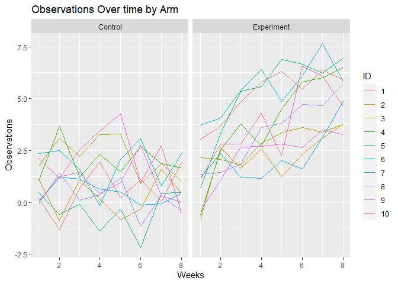
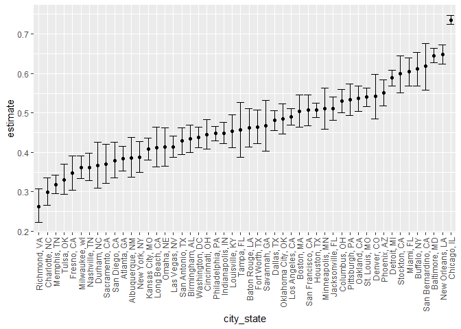
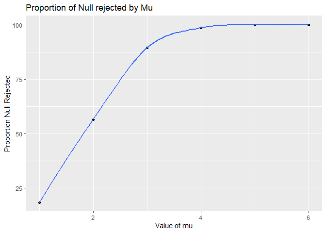
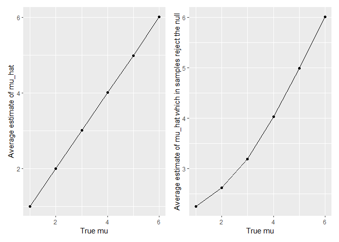

P8105_hw5
================
2022-11-04

# libraries

# Problem 1

## Create a tidy dataframe containing data from all participants, including the subject ID, arm, and observations over time

``` r
file_df <- tibble(
  files = list.files("./data")) %>%
  mutate(files = str_c("data", files, sep = "/"))

results <- file_df %>%
  mutate(results = map(files, read_csv)) %>%
  mutate(arm = ifelse(str_detect(files, "exp"), "Experiment", "Control"),
         ID = as.factor(parse_number(files))) %>%
  unnest(results) %>%
  pivot_longer(week_1:week_8,
               names_to = "week",
               values_to = "observation")%>%
  mutate(week = as.numeric(parse_number(week))) 
```

Make a spaghetti plot showing observations on each subject over time

``` r
results %>%
  ggplot(aes(x = week, y = observation,color = ID)) + geom_line() +
  ylab("Observations") +
  xlab("Weeks") +
  facet_grid(cols = vars(arm)) +
  ggtitle("Observations Over time by Arm")
```

<!-- -->

The Charts shows that the observations over time by study arm. In the
control arm, we cannnot say there is a relationship between
participants’ observation and time. However,in the experiment arm,
participants appear to be reporting higher observations as time goes on.

# Problem 2

## read data from website

``` r
url <- 'https://raw.githubusercontent.com/washingtonpost/data-homicides/master/homicide-data.csv'
homicides_df <- read_csv(url(url), na = c(" ", "Unknown"))
skimr::skim(homicides_df)
```

|                                                  |              |
|:-------------------------------------------------|:-------------|
| Name                                             | homicides_df |
| Number of rows                                   | 52179        |
| Number of columns                                | 12           |
| \_\_\_\_\_\_\_\_\_\_\_\_\_\_\_\_\_\_\_\_\_\_\_   |              |
| Column type frequency:                           |              |
| character                                        | 8            |
| numeric                                          | 4            |
| \_\_\_\_\_\_\_\_\_\_\_\_\_\_\_\_\_\_\_\_\_\_\_\_ |              |
| Group variables                                  | None         |

Data summary

**Variable type: character**

| skim_variable | n_missing | complete_rate | min | max | empty | n_unique | whitespace |
|:--------------|----------:|--------------:|----:|----:|------:|---------:|-----------:|
| uid           |         0 |          1.00 |   9 |  10 |     0 |    52179 |          0 |
| victim_last   |      5764 |          0.89 |   1 |  20 |     0 |    12686 |          0 |
| victim_first  |      5762 |          0.89 |   1 |  28 |     0 |    16639 |          0 |
| victim_race   |      4199 |          0.92 |   5 |   8 |     0 |        5 |          0 |
| victim_sex    |      4231 |          0.92 |   4 |   6 |     0 |        2 |          0 |
| city          |         0 |          1.00 |   5 |  14 |     0 |       50 |          0 |
| state         |         0 |          1.00 |   2 |   2 |     0 |       28 |          0 |
| disposition   |         0 |          1.00 |  14 |  21 |     0 |        3 |          0 |

**Variable type: numeric**

| skim_variable | n_missing | complete_rate |        mean |         sd |          p0 |         p25 |         p50 |         p75 |          p100 | hist  |
|:--------------|----------:|--------------:|------------:|-----------:|------------:|------------:|------------:|------------:|--------------:|:------|
| reported_date |         0 |          1.00 | 20130899.16 | 1123419.63 | 20070101.00 | 20100318.00 | 20121216.00 | 20150911.00 | 201511105\.00 | ▇▁▁▁▁ |
| victim_age    |      2999 |          0.94 |       31.80 |      14.42 |        0.00 |       22.00 |       28.00 |       40.00 |        102.00 | ▃▇▃▁▁ |
| lat           |        60 |          1.00 |       37.03 |       4.35 |       25.73 |       33.77 |       38.52 |       40.03 |         45.05 | ▁▅▅▇▅ |
| lon           |        60 |          1.00 |      -91.47 |      13.75 |     -122.51 |      -96.00 |      -87.71 |      -81.76 |        -71.01 | ▃▁▃▇▅ |

The homicide data set contains 52,179 observations across 12 columns.
Variables in the data set include unique id, victim’s last name,
victim’s first name, victim’s race, victim’s age, victim’s sex, city,
state, latitude, longitude, reported date of murder and disposition of
the case.

## Create city_state variable and summarize within cities to obtain the total number of homicides and the number of unsolved homicides

``` r
# create  new variables
homicides_df <- homicides_df %>% 
  mutate(city_state = str_c(city, state, sep = ", "),
         whether_solved = ifelse(
           disposition %in% c("Closed without arrest", "Open/No arrest"), "unsolved", "solved"))
```

## Filter to Baltimore

``` r
baltimore <- homicides_df %>%
  filter(city_state == "Baltimore, MD")


unsolved_baltimore_summary <- baltimore %>%
  summarize(
    unsolved = sum(whether_solved == "unsolved"),
    n=n()
  )

test <-prop.test(
  x = unsolved_baltimore_summary %>% pull(unsolved),
  n = unsolved_baltimore_summary %>% pull(n)
)

test %>%
  broom::tidy()
```

    ## # A tibble: 1 × 8
    ##   estimate statistic  p.value parameter conf.low conf.high method        alter…¹
    ##      <dbl>     <dbl>    <dbl>     <int>    <dbl>     <dbl> <chr>         <chr>  
    ## 1    0.646      239. 6.46e-54         1    0.628     0.663 1-sample pro… two.si…
    ## # … with abbreviated variable name ¹​alternative

## run prop.test in other cities

``` r
# table for each city
city_df <- homicides_df %>%
  group_by(city_state) %>%
  filter(city_state != "Tulsa, AL") %>% #Tulsa is not in AL
  summarise(
    unsolved = sum(whether_solved == "unsolved"),
    n = n()) 

results_df = 
  city_df %>% 
  mutate(
    prop_tests = map2(.x = unsolved, .y = n, ~prop.test(x = .x, n = .y)),
    tidy_tests = map(.x = prop_tests, ~broom::tidy(.x))
  ) %>% 
  select(-prop_tests) %>% 
  unnest(tidy_tests) %>% 
  select(city_state, estimate, conf.low,conf.high) 
  
results_df %>%
  knitr::kable()
```

| city_state         |  estimate |  conf.low | conf.high |
|:-------------------|----------:|----------:|----------:|
| Albuquerque, NM    | 0.3862434 | 0.3372604 | 0.4375766 |
| Atlanta, GA        | 0.3833505 | 0.3528119 | 0.4148219 |
| Baltimore, MD      | 0.6455607 | 0.6275625 | 0.6631599 |
| Baton Rouge, LA    | 0.4622642 | 0.4141987 | 0.5110240 |
| Birmingham, AL     | 0.4337500 | 0.3991889 | 0.4689557 |
| Boston, MA         | 0.5048860 | 0.4646219 | 0.5450881 |
| Buffalo, NY        | 0.6122841 | 0.5687990 | 0.6540879 |
| Charlotte, NC      | 0.2998544 | 0.2660820 | 0.3358999 |
| Chicago, IL        | 0.7358627 | 0.7239959 | 0.7473998 |
| Cincinnati, OH     | 0.4452450 | 0.4079606 | 0.4831439 |
| Columbus, OH       | 0.5304428 | 0.5002167 | 0.5604506 |
| Dallas, TX         | 0.4811742 | 0.4561942 | 0.5062475 |
| Denver, CO         | 0.5416667 | 0.4846098 | 0.5976807 |
| Detroit, MI        | 0.5883287 | 0.5687903 | 0.6075953 |
| Durham, NC         | 0.3659420 | 0.3095874 | 0.4260936 |
| Fort Worth, TX     | 0.4644809 | 0.4222542 | 0.5072119 |
| Fresno, CA         | 0.3470226 | 0.3051013 | 0.3913963 |
| Houston, TX        | 0.5074779 | 0.4892447 | 0.5256914 |
| Indianapolis, IN   | 0.4493192 | 0.4223156 | 0.4766207 |
| Jacksonville, FL   | 0.5111301 | 0.4820460 | 0.5401402 |
| Kansas City, MO    | 0.4084034 | 0.3803996 | 0.4370054 |
| Las Vegas, NV      | 0.4141926 | 0.3881284 | 0.4407395 |
| Long Beach, CA     | 0.4126984 | 0.3629026 | 0.4642973 |
| Los Angeles, CA    | 0.4900310 | 0.4692208 | 0.5108754 |
| Louisville, KY     | 0.4531250 | 0.4120609 | 0.4948235 |
| Memphis, TN        | 0.3190225 | 0.2957047 | 0.3432691 |
| Miami, FL          | 0.6048387 | 0.5685783 | 0.6400015 |
| Milwaukee, wI      | 0.3614350 | 0.3333172 | 0.3905194 |
| Minneapolis, MN    | 0.5109290 | 0.4585150 | 0.5631099 |
| Nashville, TN      | 0.3624511 | 0.3285592 | 0.3977401 |
| New Orleans, LA    | 0.6485356 | 0.6231048 | 0.6731615 |
| New York, NY       | 0.3875598 | 0.3494421 | 0.4270755 |
| Oakland, CA        | 0.5364308 | 0.5040588 | 0.5685037 |
| Oklahoma City, OK  | 0.4851190 | 0.4467861 | 0.5236245 |
| Omaha, NE          | 0.4132029 | 0.3653146 | 0.4627477 |
| Philadelphia, PA   | 0.4478103 | 0.4300380 | 0.4657157 |
| Phoenix, AZ        | 0.5514223 | 0.5184825 | 0.5839244 |
| Pittsburgh, PA     | 0.5340729 | 0.4942706 | 0.5734545 |
| Richmond, VA       | 0.2634033 | 0.2228571 | 0.3082658 |
| Sacramento, CA     | 0.3696809 | 0.3211559 | 0.4209131 |
| San Antonio, TX    | 0.4285714 | 0.3947772 | 0.4630331 |
| San Bernardino, CA | 0.6181818 | 0.5576628 | 0.6753422 |
| San Diego, CA      | 0.3796095 | 0.3354259 | 0.4258315 |
| San Francisco, CA  | 0.5067873 | 0.4680516 | 0.5454433 |
| Savannah, GA       | 0.4674797 | 0.4041252 | 0.5318665 |
| St. Louis, MO      | 0.5396541 | 0.5154369 | 0.5636879 |
| Stockton, CA       | 0.5990991 | 0.5517145 | 0.6447418 |
| Tampa, FL          | 0.4567308 | 0.3881009 | 0.5269851 |
| Tulsa, OK          | 0.3310463 | 0.2932349 | 0.3711192 |
| Washington, DC     | 0.4379182 | 0.4112495 | 0.4649455 |

## Create a plot that shows the estimates and CIs for each city

``` r
results_df %>% 
  mutate(city_state = fct_reorder(city_state, estimate)) %>% 
  ggplot(aes(x = city_state, y = estimate)) +
  geom_point() + 
  geom_errorbar(aes(ymin = conf.low, ymax = conf.high)) +
  theme(axis.text.x = element_text(angle = 90, vjust = 0.5, hjust = 1))
```

<!-- -->

# Problem 3

## Set μ=0

``` r
set.seed(100)
sim = function(n=30, mu, sigma = 5) {
  
  sim_data = tibble(
    x = rnorm(n, mean = mu, sd = sigma),
  )
  
  sim_data %>% 
    t.test(mu = 0, conf.level = 0.95) %>% 
    broom::tidy() %>% 
    select(estimate, p.value)
}

# Generate 5000 datasets and apply the function
output_list =
  rerun(5000, sim(30, 0, 5)) %>%
  bind_rows()
output_list
```

    ## # A tibble: 5,000 × 2
    ##    estimate p.value
    ##       <dbl>   <dbl>
    ##  1    0.144   0.823
    ##  2    0.463   0.667
    ##  3   -0.219   0.827
    ##  4   -0.375   0.680
    ##  5   -0.796   0.259
    ##  6    0.838   0.240
    ##  7   -0.358   0.688
    ##  8   -0.546   0.505
    ##  9    0.323   0.779
    ## 10    0.974   0.247
    ## # … with 4,990 more rows

## Repeat the above for μ={1,2,3,4,5,6}

``` r
sim_results = 
  tibble(mu = 1:6) %>% 
  mutate(
    output_lists = map(.x = mu, ~rerun(5000, sim(mu = .x))),
    estimate_dfs = map(output_lists, bind_rows)) %>% 
  select(-output_lists) %>% 
  unnest(estimate_dfs)
```

## Make a plot showing the proportion of times the null was rejected (the power of the test) on the y axis and the true value of μ on the x axis. Describe the association between effect size and power.

``` r
sim_results %>%
  group_by(mu) %>%
  summarize(n = n(),
            power = sum(p.value < .05)/n()*100) %>%
ggplot(aes(x = mu, y = power)) + 
  geom_point() + 
  geom_smooth(se = FALSE) + 
  labs(x = "Value of mu", y = "Proportion Null Rejected", title = "Proportion of Null rejected by Mu")
```

    ## `geom_smooth()` using method = 'loess' and formula 'y ~ x'

<!-- --> We can
see as the effect size increases,the power increases. But the increasing
rate gets smaller.

## Make a plot showing the average estimate of μ^ on the y axis and the true value of μ on the x axis. Make a second plot (or overlay on the first) the average estimate of μ^ only in samples for which the null was rejected on the y axis and the true value of μ on the x axis.

``` r
# First plot
plot1 <- sim_results %>%
  group_by(mu)%>%
  summarize(
    avg_mu_hat = mean(estimate),
    ) %>%
  ggplot(aes(y = avg_mu_hat, x = mu)) +
  geom_point()+
  geom_path()+
  labs(
    x = "True mu",
    y = "Average estimate of mu_hat"
  )

plot2 <- sim_results %>% 
      filter(p.value<0.05) %>% 
      group_by(mu) %>% 
      summarise(
        avg_mu_hat_rej = mean(estimate)
      )%>%
  ggplot(aes(y = avg_mu_hat_rej, x = mu)) +
  geom_point()+
  geom_path()+
  labs(
    x = "True mu",
    y = "Average estimate of mu_hat which in samples reject the null"
  )
plot1 + plot2
```

<!-- --> The
sample average for which the null is rejected approximately equal to the
true value of mu when effect power of the test is large, when power is
small, true mu is always smaller than average estimate.
